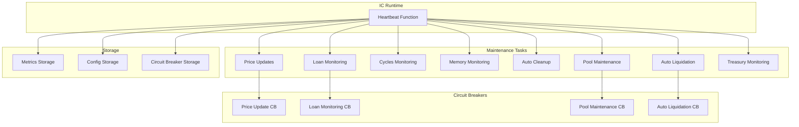

# 🔧 Agrilends Automated Maintenance (Heartbeat) - Production Implementation

**Version:** 1.0.0  
**Last Updated:** July 24, 2025  
**Status:** ✅ Production Ready

## 📋 Overview

Implementasi lengkap sistem **Automated Maintenance (Heartbeat)** untuk Agrilends Protocol yang memberikan kemampuan monitoring dan pemeliharaan otomatis 24/7 tanpa intervensi manual. Sistem ini dirancang khusus untuk production environment dengan error handling yang robust, circuit breaker pattern, dan comprehensive monitoring.

## 🏗️ Architecture Overview



## 🔑 Key Features

### ✅ Core Functionality
- **Automated Price Updates**: Oracle price refresh untuk komoditas stale (>24 jam)
- **Loan Monitoring**: Deteksi pinjaman overdue dan kandidat likuidasi
- **Resource Monitoring**: Cycles balance, memory usage, system health
- **Auto Cleanup**: Pembersihan audit logs dan transaksi lama
- **Pool Maintenance**: Health check dan optimisasi liquidity pool
- **Auto Liquidation**: Trigger likuidasi otomatis setelah threshold tertentu
- **Treasury Monitoring**: Monitor balance dan top-up cycles

### 🛡️ Production Features
- **Circuit Breaker Pattern**: Isolasi failure untuk mencegah cascade issues
- **Comprehensive Metrics**: Tracking execution time, success rate, error rate
- **Error Recovery**: Graceful error handling dan retry mechanisms
- **Emergency Controls**: Pause/resume operations untuk maintenance
- **Admin Controls**: Role-based access untuk configuration changes
- **Real-time Monitoring**: Dashboard untuk monitoring dan control

## 📊 Implementation Details

### 1. Data Structures

```rust
#[derive(CandidType, Deserialize, Clone, Debug)]
pub struct HeartbeatConfig {
    pub enabled: bool,
    pub maintenance_mode: bool,
    pub price_update_enabled: bool,
    pub loan_monitoring_enabled: bool,
    pub cycles_monitoring_enabled: bool,
    pub auto_cleanup_enabled: bool,
    pub pool_maintenance_enabled: bool,
    pub auto_liquidation_enabled: bool,
    pub auto_liquidation_threshold_days: u64,
    pub memory_monitoring_enabled: bool,
    pub oracle_monitoring_enabled: bool,
    pub treasury_monitoring_enabled: bool,
}

#[derive(CandidType, Deserialize, Clone, Debug)]
pub struct HeartbeatMetrics {
    pub last_execution_time: u64,
    pub total_executions: u64,
    pub successful_executions: u64,
    pub failed_executions: u64,
    pub average_execution_time: u64,
    pub tasks_completed: HashMap<String, u64>,
    pub last_error: Option<String>,
    pub last_error_time: Option<u64>,
    pub total_execution_time: u64,
    pub peak_execution_time: u64,
    pub last_maintenance_tasks: Vec<String>,
}

#[derive(CandidType, Deserialize, Clone, Debug)]
pub struct CircuitBreaker {
    pub failure_count: u64,
    pub last_failure_time: u64,
    pub threshold: u64,
    pub timeout: u64,
    pub state: CircuitBreakerState,
}
```

### 2. Main Heartbeat Function

```rust
#[heartbeat]
async fn heartbeat() {
    // Delegate to comprehensive automated maintenance system
    automated_maintenance::canister_heartbeat().await;
}

/// Main heartbeat implementation in automated_maintenance module
pub async fn canister_heartbeat() {
    let execution_start = time();
    let mut tasks_executed = Vec::new();
    let mut successful_tasks = 0u64;
    let mut failed_tasks = 0u64;
    
    // Update execution tracking
    HEARTBEAT_EXECUTION_COUNT.with(|count| *count.borrow_mut() += 1);
    LAST_HEARTBEAT_TIME.with(|last_time| *last_time.borrow_mut() = execution_start);
    
    // Check if heartbeat should run
    let config = get_heartbeat_config();
    if !config.enabled || is_in_maintenance_mode() || get_emergency_stop_status() {
        return;
    }
    
    // Execute all maintenance tasks with error isolation
    // ... (implementation details in automated_maintenance.rs)
}
```

### 3. Maintenance Tasks

#### a. Oracle Price Updates
```rust
async fn oracle_price_update_task() -> Result<String, String> {
    let commodities = vec!["rice".to_string(), "corn".to_string(), "wheat".to_string()];
    let mut updated_count = 0;
    let mut errors = Vec::new();
    
    for commodity in commodities {
        if is_price_stale(commodity.clone()) {
            match oracle::fetch_commodity_price(commodity.clone()).await {
                Ok(_) => {
                    updated_count += 1;
                    log_audit_action(/* success log */);
                },
                Err(e) => {
                    errors.push(format!("{}: {}", commodity, e));
                    log_audit_action(/* error log */);
                }
            }
        }
    }
    
    if errors.is_empty() {
        Ok(format!("Updated {} commodity prices", updated_count))
    } else {
        Err(format!("Errors updating prices: {:?}", errors))
    }
}
```

#### b. Loan Monitoring
```rust
async fn loan_monitoring_task() -> Result<String, String> {
    let overdue_loans = get_overdue_loans();
    let mut monitored_count = 0;
    let mut liquidation_candidates = 0;
    
    for loan in overdue_loans {
        monitored_count += 1;
        
        // Check liquidation eligibility
        if let Ok(eligible) = crate::liquidation::check_liquidation_eligibility(loan.id) {
            if eligible.is_eligible {
                liquidation_candidates += 1;
                log_audit_action(/* liquidation candidate detected */);
            }
        }
    }
    
    Ok(format!("Monitored {} overdue loans, {} liquidation candidates", 
               monitored_count, liquidation_candidates))
}
```

#### c. Resource Monitoring
```rust
async fn cycles_monitoring_task() -> Result<String, String> {
    let current_cycles = ic_cdk::api::canister_balance();
    
    if current_cycles < CYCLES_THRESHOLD_CRITICAL {
        log_audit_action(/* critical cycles log */);
        Err(format!("Critical cycles level: {}", current_cycles))
    } else if current_cycles < CYCLES_THRESHOLD_ALERT {
        log_audit_action(/* low cycles warning */);
        Ok(format!("Low cycles warning: {}", current_cycles))
    } else {
        Ok(format!("Cycles healthy: {}", current_cycles))
    }
}
```

### 4. Circuit Breaker Implementation

```rust
fn should_execute_task(task_name: &str) -> bool {
    CIRCUIT_BREAKERS.with(|breakers| {
        let breakers_map = breakers.borrow();
        if let Some(breaker) = breakers_map.get(task_name) {
            match breaker.state {
                CircuitBreakerState::Closed => true,
                CircuitBreakerState::Open => {
                    // Check if timeout expired for recovery
                    let current_time = time();
                    if current_time - breaker.last_failure_time > breaker.timeout {
                        true // Try again (half-open state)
                    } else {
                        false // Still open
                    }
                },
                CircuitBreakerState::HalfOpen => true,
            }
        } else {
            true // No circuit breaker = allow execution
        }
    })
}

fn record_task_success(task_name: &str) {
    CIRCUIT_BREAKERS.with(|breakers| {
        let mut breakers_map = breakers.borrow_mut();
        let mut breaker = breakers_map.get(task_name).unwrap_or_default();
        breaker.failure_count = 0;
        breaker.state = CircuitBreakerState::Closed;
        breakers_map.insert(task_name.to_string(), breaker);
    });
}

fn record_task_failure(task_name: &str) {
    CIRCUIT_BREAKERS.with(|breakers| {
        let mut breakers_map = breakers.borrow_mut();
        let mut breaker = breakers_map.get(task_name).unwrap_or_default();
        breaker.failure_count += 1;
        breaker.last_failure_time = time();
        
        if breaker.failure_count >= breaker.threshold {
            breaker.state = CircuitBreakerState::Open;
        }
        
        breakers_map.insert(task_name.to_string(), breaker);
    });
}
```

## 🎯 Configuration & Controls

### Admin Functions

```rust
/// Update heartbeat configuration (admin only)
#[update]
pub fn update_heartbeat_config(new_config: HeartbeatConfig) -> Result<String, String> {
    let caller = caller();
    if !is_admin(&caller) {
        return Err("Unauthorized: Only admins can update heartbeat configuration".to_string());
    }
    
    HEARTBEAT_CONFIG.with(|config| {
        config.borrow_mut().insert(0, new_config.clone());
    });
    
    log_audit_action(/* config update log */);
    Ok("Heartbeat configuration updated successfully".to_string())
}

/// Emergency pause heartbeat (admin only)
#[update]
pub fn emergency_pause_heartbeat() -> Result<String, String> {
    let caller = caller();
    if !is_admin(&caller) {
        return Err("Unauthorized: Only admins can pause heartbeat".to_string());
    }
    
    let mut config = get_canister_config();
    config.maintenance_mode = true;
    set_canister_config(config)?;
    
    log_audit_action(/* emergency pause log */);
    Ok("Heartbeat operations paused successfully".to_string())
}

/// Get heartbeat metrics (admin only)
#[query]
pub fn get_heartbeat_metrics() -> Result<HeartbeatMetrics, String> {
    let caller = caller();
    if !is_admin(&caller) {
        return Err("Unauthorized: Only admins can view heartbeat metrics".to_string());
    }
    
    Ok(HEARTBEAT_METRICS.with(|metrics| {
        metrics.borrow().get(&0).unwrap_or_default()
    }))
}
```

### Production Health Check

```rust
#[query]
pub fn production_health_check_with_heartbeat() -> ProductionHealthStatus {
    let config = get_canister_config();
    let heartbeat_config = get_heartbeat_config();
    let last_heartbeat = get_last_heartbeat_time();
    let current_time = time();
    
    // Check if heartbeat is recent (within last 2 minutes)
    let heartbeat_healthy = (current_time - last_heartbeat) < (2 * 60 * 1_000_000_000);
    
    ProductionHealthStatus {
        is_healthy: !config.emergency_stop && !config.maintenance_mode && heartbeat_healthy,
        emergency_stop: config.emergency_stop,
        maintenance_mode: config.maintenance_mode,
        oracle_status: check_oracle_health(),
        ckbtc_integration: check_ckbtc_health(),
        memory_usage: get_memory_usage(),
        total_loans: get_active_loans_count(),
        active_loans: get_active_loans_count(),
        last_heartbeat,
    }
}
```

## 📊 Monitoring & Dashboard

### Advanced Dashboard Features
- **Real-time Metrics**: Auto-refresh setiap 30 detik
- **System Health Overview**: Status keseluruhan sistem
- **Performance Metrics**: Execution time, success rate, dll
- **Resource Monitoring**: Memory, cycles, active loans
- **Circuit Breaker Status**: Real-time status semua circuit breakers
- **Configuration Controls**: Toggle untuk enable/disable tasks
- **Emergency Controls**: Pause/resume operations
- **Task History**: Timeline maintenance tasks terbaru

### Dashboard Access
- File: `heartbeat_advanced_dashboard.html`
- Features: Production-ready monitoring interface
- Security: Admin-only controls untuk critical operations
- Responsive: Mobile-friendly design

## 🚀 Deployment & Production Considerations

### 1. Resource Management
```rust
// Constants for production deployment
const MEMORY_WARNING_THRESHOLD: u64 = 1_000_000_000; // 1GB
const CYCLES_THRESHOLD_ALERT: u64 = 1_000_000_000_000; // 1T cycles
const CYCLES_THRESHOLD_CRITICAL: u64 = 500_000_000_000; // 500B cycles
const MAX_AUDIT_LOGS: usize = 10_000;
const AUTO_LIQUIDATION_THRESHOLD_DAYS: u64 = 45;
const CIRCUIT_BREAKER_THRESHOLD: u64 = 5;
const CIRCUIT_BREAKER_TIMEOUT: u64 = 300_000_000_000; // 5 minutes
```

### 2. Security Considerations
- **Access Control**: Hanya admin yang dapat modify configuration
- **Error Isolation**: Circuit breaker mencegah cascade failures
- **Audit Logging**: Comprehensive logging untuk compliance
- **Emergency Controls**: Emergency pause untuk incident response

### 3. Performance Optimization
- **Batch Processing**: Tasks dijalankan secara efficient
- **Memory Management**: Auto cleanup untuk prevent memory leaks
- **Error Recovery**: Graceful degradation saat ada issues
- **Rate Limiting**: Prevent resource exhaustion

### 4. Monitoring & Alerting
- **Health Checks**: Continuous monitoring system health
- **Metrics Collection**: Comprehensive performance metrics
- **Error Tracking**: Detailed error logging dan recovery
- **Dashboard Integration**: Real-time monitoring interface

## 🔄 Maintenance Procedures

### Regular Operations
1. **Daily**: Check dashboard untuk overall health
2. **Weekly**: Review heartbeat metrics dan performance
3. **Monthly**: Analyze trends dan optimize configuration
4. **Quarterly**: Full system audit dan capacity planning

### Emergency Procedures
1. **System Issues**: Use emergency pause untuk isolate problems
2. **Performance Problems**: Adjust thresholds atau disable tasks
3. **Circuit Breaker Trips**: Investigate root cause dan reset
4. **Resource Exhaustion**: Emergency top-up cycles atau optimize

### Configuration Updates
1. **Test Changes**: Always test configuration changes di staging
2. **Gradual Rollout**: Enable new features gradually
3. **Monitor Impact**: Watch metrics setelah configuration changes
4. **Rollback Plan**: Have rollback procedure ready

## 📈 Future Enhancements

### Planned Features
- **Advanced Scheduling**: Custom schedules untuk different tasks
- **Dynamic Configuration**: Runtime configuration changes
- **Health Scoring**: Advanced health scoring system components
- **Predictive Maintenance**: ML-based predictive capabilities
- **Multi-Canister Coordination**: Coordinated heartbeat across canisters

### Scalability Improvements
- **Distributed Tasks**: Distribute tasks across multiple cycles
- **Priority Queueing**: Priority-based task execution
- **Load Balancing**: Balance load across execution windows
- **Adaptive Scheduling**: Adaptive scheduling based on system load

## 📚 API Reference

### Query Functions
- `get_heartbeat_config() -> HeartbeatConfig`
- `get_heartbeat_metrics() -> Result<HeartbeatMetrics, String>`
- `get_last_heartbeat_time() -> u64`
- `get_heartbeat_execution_count() -> u64`
- `production_health_check_with_heartbeat() -> ProductionHealthStatus`
- `get_system_maintenance_report() -> Result<SystemMaintenanceReport, String>`
- `get_circuit_breaker_status() -> Result<HashMap<String, CircuitBreaker>, String>`

### Update Functions
- `update_heartbeat_config(config: HeartbeatConfig) -> Result<String, String>`
- `emergency_pause_heartbeat() -> Result<String, String>`
- `resume_heartbeat_operations() -> Result<String, String>`
- `reset_circuit_breakers() -> Result<String, String>`

## 🔍 Troubleshooting

### Common Issues

#### Heartbeat Not Running
1. Check `is_in_maintenance_mode()` status
2. Verify `get_emergency_stop_status()` is false
3. Check heartbeat config `enabled` flag
4. Review system health status

#### Tasks Failing
1. Check circuit breaker status
2. Review error logs dalam audit system
3. Verify resource availability (cycles, memory)
4. Check external dependencies (oracle, ckBTC)

#### Performance Issues
1. Monitor execution times dalam metrics
2. Check memory usage trends
3. Review task frequency dan load
4. Optimize task configuration

#### Configuration Issues
1. Verify admin permissions
2. Check configuration validation
3. Review audit logs untuk changes
4. Test configuration dalam staging

### Debugging Commands
```bash
# Check system health
dfx canister call agrilends_backend production_health_check_with_heartbeat

# Get heartbeat metrics
dfx canister call agrilends_backend get_heartbeat_metrics

# Check circuit breaker status
dfx canister call agrilends_backend get_circuit_breaker_status

# Get system maintenance report
dfx canister call agrilends_backend get_system_maintenance_report
```

## 📝 Changelog

### Version 1.0.0 (July 24, 2025)
- ✅ Initial production implementation
- ✅ Complete heartbeat system dengan all maintenance tasks
- ✅ Circuit breaker pattern implementation
- ✅ Comprehensive metrics dan monitoring
- ✅ Advanced dashboard interface
- ✅ Admin controls dan security
- ✅ Error handling dan recovery
- ✅ Production-ready documentation

---

**🌾 Agrilends Protocol - Automated Maintenance System**  
**Built with ❤️ for Internet Computer**

**Contact**: Development Team  
**Repository**: `src/agrilends_backend/src/automated_maintenance.rs`  
**Dashboard**: `heartbeat_advanced_dashboard.html`
